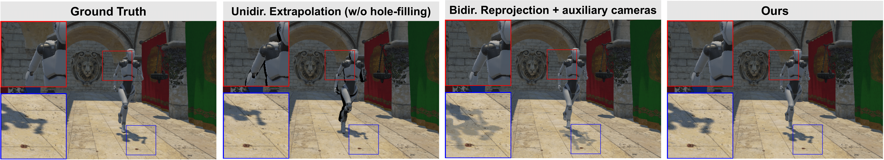

# Image-Based Spatio-Temporal Interpolation for Split Rendering
[Michael Steiner](https://steimich96.github.io/)<sup>&#42;</sup>,
[Thomas Köhler](https://scholar.google.com/citations?user=pMDepi0AAAAJ&hl=de)<sup>&#42;</sup>,
[Lukas Radl](https://r4dl.github.io/),
[Brian Budge](https://scholar.google.com/citations?user=z67HnEwAAAAJ&hl=en),
[Markus Steinberger](https://www.markussteinberger.net/)
<br> 
<sup>&#42;</sup> denotes equal contribution
<br>

[Project Page](https://derthomy.github.io/ImageBasedSpatioTemporalInterpolation/)
| [Full Paper](https://diglib.eg.org/items/f64629bd-34a4-4880-af25-5de3f57c6fa9)
| [Dataset](https://drive.google.com/file/d/1U4uUS6L-rxr1jFrJ-b991SQP63G10hkA/view?usp=sharing)



This repository contains the **compression**, **interpolation** and **evaluation** part of the official authors implementation associated with the paper "Image-Based Spatio-Temporal Interpolation for Split Rendering".

Abstract: *Low-powered devices – such as small form factor head-mounted displays (HMDs) – struggle to deliver a smooth and high-
quality viewing experience, due to their limited power and rendering capabilities. Cloud rendering attempts to solve the quality
issue, but leads to prohibitive latency and bandwidth requirements, hindering use with HMDs over mobile connections or
even over Wifi. One solution – split rendering – where frames are partially rendered on the client device, often either requires
geometry and rendering hardware, or struggles to generate frames faithfully under viewpoint changes and object motion. Our
method enables spatio-temporal interpolation via bidirectional reprojection to efficiently generate intermediate frames in a
split rendering setting, while limiting the communication cost and relying purely on image-based rendering. Furthermore, our
method is robust to modest connectivity issues and handles effects such as dynamic smooth shadows.*

<section class="section" id="BibTeX">
  <div class="container is-max-desktop content">
    <h2 class="title">BibTeX</h2>
    <pre><code>@article{steiner2025SplitRendering,
      author       = {Steiner, Michael and K{\"o}hler, Thomas and Radl, Lukas and Budge, Brian and Steinberger, Markus},
      title        = {{Image-Based Spatio-Temporal Interpolation for Split Rendering}},
      journal      = {Computer Graphics Forum},
      number       = {8},
      volume       = {44},
      year         = {2025}
}</code></pre>
  </div>
</section>

## Dependencies

- **Operating System**: Windows recommended (.bat evaluation scripts)
- **CMake**: Version 3.26 or higher
- **Compiler**: Must support C++20
- **CUDA Toolkit**
- **Anaconda**

# Setup

Clone the repository:

```
git clone https://github.com/DerThomy/ImageBasedSpatioTemporalInterpolation --recursive
```

### Compiling:

```
mkdir build
cd build
cmake ..
```

### Python:

Create Conda environment

```
conda env create -f env.yaml
conda activate splitrendering
```

# Running

The source code was tested on Windows 11 with an NVIDIA RTX 3090 and NVIDIA RTX 4090.

The standalone C++ code for our method as proposed in the paper can be run with the following command, which writes (`-w`) all resulting images to the output directory, following the client camera path and using the left and right auxiliary cameras (if provided in the input directory):

```
.\build\splinter.exe <input-dir-root> <output-dir-root> -c <input-dir-client-camera> -w -m 0 -a left right
```

Calling `.\build\splinter.exe --help` gives additional information about other useful flags.

We provide additional scripts that run our full ablations.
These scripts build on top of each other, but can also be executed singularly, depending on the granularity of your desired evaluation:

1. `.\scripts\run.bat ..\Recordings sponza client_ol ..\Renderings\sponza ours "-m 0 -a left right -r" -v`, e.g. calls `splinter.exe` and renders the sponza scene located in `..\Recordings\sponza` with the camera file in `..\Recordings\sponza\client_ol\cam.json` and renders (`-r`) the images and a video (`-v`) to `..\Renderings\sponza\ours`. See the script for additional flags to run VMAF eval (`-vmaf`), the full eval python script (`-e`) and more.
2. `.\scripts\run_benchmarks.bat ..\Recordings sponza ..\Renderings\sponza`, e.g. evaluates 5 different methods on the sponza scene, runs the full evaluation on all of them. It gives a good overview how other methods can be executed in our code. Currently, the script deletes all output images (`-r`) to save on memory. The script also contains other (commented out) method lists, e.g. our component ablation.
3. `python eval_compression.py` compresses the ground truth unity output by calling `compression.py` for different bitrates (10, 20, ..., 100 Mb/s) and executes `.\scripts\run_benchmarks.bat` for each of them, as well as once for the uncompressed data. It also evaluates the image and video metrics on the compressed client video stream.

The output folders will contain the per frame metrics `per_image_results.json` and summary `results.json` of all evaluated frames.
The compression script will additionally write a `compression_results.json` into the compressed recordings folder, which contains individual before/after sizes for all compressed buffers.

